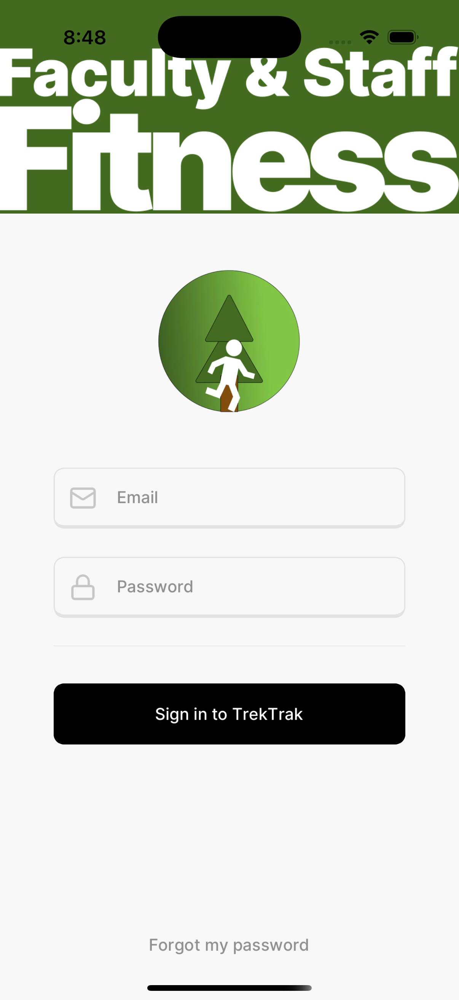
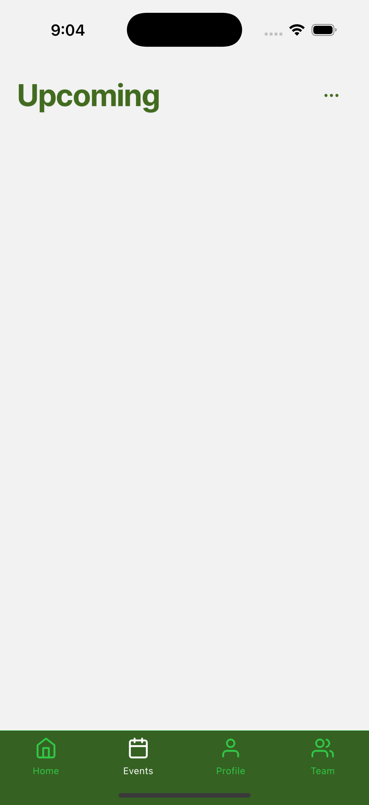
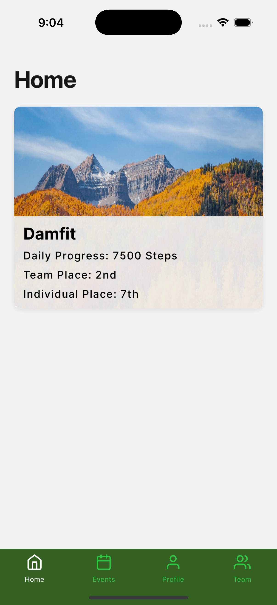
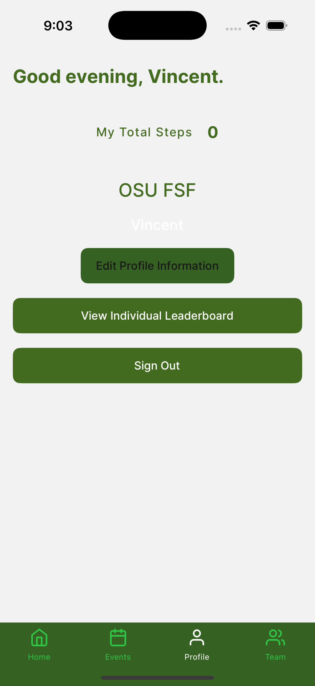
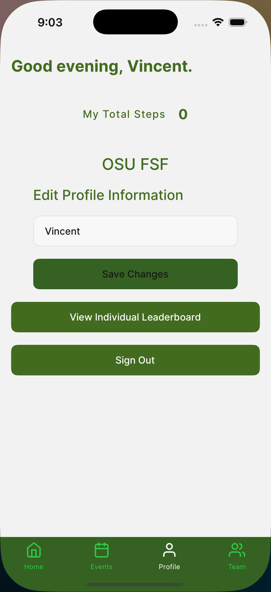
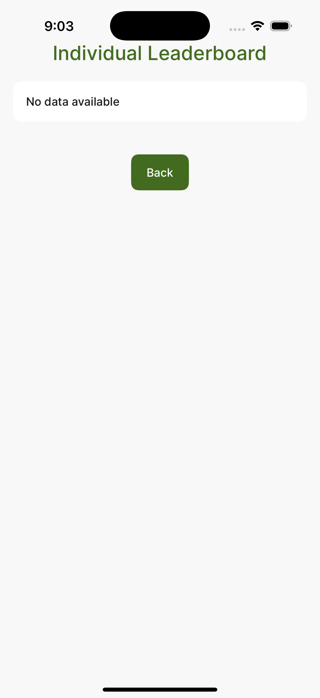
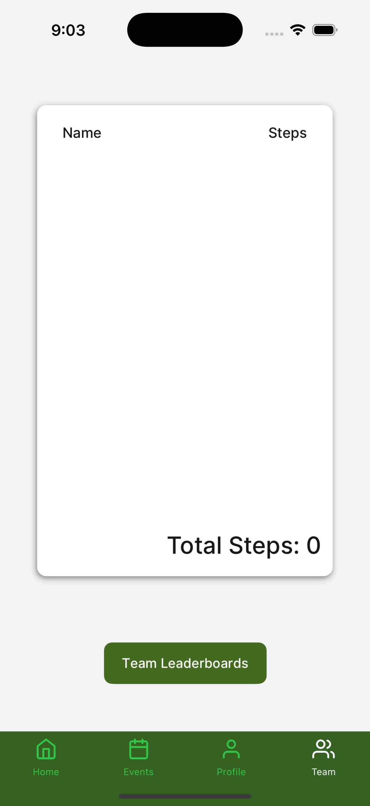
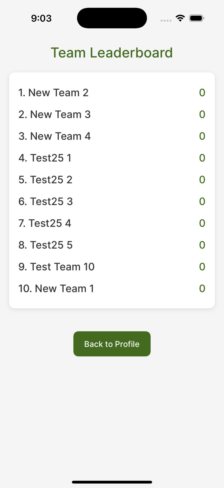

# TrekTrak

## Description
The TrekTrak project was created to better fit the needs of fitness event organizers in managing large scale events such as walkathons. TrekTrak is split up into two applications consisting of our facilitator web app and our event participant mobile app. Facilitators can create and track events while our mobile app allows users to participate in events and track their progress. TrekTrak is currently in the progress of beta testing and currently running step based events. 

## Table of Contents
- [Installation](#installation)
- [Usage](#usage)
- [References](#references)

## Installation

### Prerequisites
- Node.js
- npm (Node Package Manager)

### Step-by-Step Instructions

#### Web Application

1. Clone the repository:
    ```bash
    git clone https://github.com/adulbrich/TrekTrak.git
    ```

2. Navigate to the web app directory:
    ```bash
    cd src-web-app
    ```

3. Install the dependencies:
    ```bash
    npm install
    ```

4. Start the development server:
    ```bash
    npm run dev
    ```

#### Mobile Application

1. Clone the repository (if not already done for the web app)
    ```bash
    git clone https://github.com/adulbrich/TrekTrak.git
    ```

2. Navigate to the mobile app directory:
    ```bash
    cd src-mobile-app
    ```

3. Install the dependencies:
    ```bash
    npm install
    ```

4. Set up .env file
    ```
    # /src-mobile-app/.env
    EXPO_PUBLIC_SUPABASE_URL="<supabase url>"
    EXPO_PUBLIC_SUPABASE_ANON_KEY="<supabase anon key>"
    ```
5. Set up mobile emulator
    Android 
        a. Open Android Studio
        b. Go to Virtual Device Manager
        c. Select Run or Create virtual device

    iOS (Mac only)
        a. Open Xcode simulator

6. Replace index.js in node_modules/react-native-health  
    Copy and paste the text within the comment in the file ```src/lib/react-native-health-fix.ts```  

7. Start the Expo development server:
    ```bash
    npx expo run:android
    ``` 
    or 
    ```bash
    npx expo run:ios
    ```

#### Starlight Documentation

Everything you need to know about the project is in the Starlight documentation. 

1. Clone the repository:
    ```bash
    git clone https://github.com/OregonStateUniversity/osu-fsf.git
    ```
2. Navigate to the Starlight directory:
    ```bash
    cd src-docs
    ```
3. Install the dependencies:
    ```bash
    npm install
    ```
4. Start the development server:
    ```bash
    npm run dev
    ```


## Usage

### Web Application
The web application is used by event organizers to create and manage events. Once the server is running, navigate to the provided URL to access the application.

The web page should only be accessible by event facilitators within organizations, as they will first need to sign in using a provided login given by the developers. Event participants will only need the mobile platform to track their progress. 


The main page displays all on-going events across all organizations, along with all past events and upcoming events. Each block contains the event title, description, date range, etc. Organizers can view each event's dedicated page with additional information and statistics. 


Above, the main functionalities for the web page are accessible through buttons. Organizers are able to create events by clicking the green "Create Event" button, which brings them to a page where they can freely customize every element of their event. Here, they can set the reward system to be however they want for their participants, along with any achievements. Organizers need to also specify whether their event is defined by the amount of steps or distance taken by each participant.


To add users/participants to their events, click on the "Add Profile" button to navigate to the associated page. Here, organizers can create logins for their participants to use to sign in on the mobile platform. It's important to specify the organization they should be added to at the bottom, and avoid misspellings in each field. Users will be added to the database, and any progress they make will be tracked on the mobile app. Make sure to give each user the email and password entered for them. 

### Mobile Application

The mobile application allows users to join events, track their steps, and compete with other teams. After starting the Expo development server, use the **Expo Go** app on your mobile device to scan the provided QR code and launch the application.

For beta testing or public distribution, the app can be published to the Apple App Store and Google Play Store. Developers may need to submit the app for review and then send download links to users via email.

---

### Login / Signup Page

The login page allows users to sign in to their accounts. Only users who are **pre-registered** in Supabase (our backend database) can log in. Self-registration through the app is **not supported**. Instead, event administrators must provide developers with a list of approved users to create accounts manually.

<div style="display: flex; gap: 10px;">
    
</div>

---

### Events

The **Events** page is currently the landing page after login. It lists all current and upcoming events that a user is eligible to join. Users can view event details, join available events, and manage their team memberships for each event.
<div style="display: flex; gap: 10px;">
    
</div>

---

### Home Page

The **Home** page gives users an overview of their current events, recent progress, and a snapshot of leaderboard statistics. It combines information from both the individual and team leaderboard pages, making it a useful summary screen for personal performance tracking.
<div style="display: flex; gap: 10px;">
    
</div>

---

### Individual Page

The **Individual** page displays personal information including the user's name and email. It also shows the individual leaderboard, where users can see how their step count ranks against other participants.

<div style="display: flex; gap: 10px;">
  
  
  
</div>
---

### Team Leaderboard

The **Team Leaderboard** page shows all teams that the user is a part of, along with each team’s ranking based on total steps. It helps users track their team’s progress and competitive standing throughout the event.
<div style="display: flex; gap: 10px;">
  
  
</div>

## FAQ

#### Why is Expo Go not working?

- If you are having trouble, make sure your internet connection is set to private on your laptop and mobile device, make sure your network has device discovery enabled, make sure your firewall is not blocking the connection, and make sure your mobile device is on the same network as your laptop. If you are still having trouble, try using the tunnel option in the Expo Go app. If you are using a Mac and still having trouble, try using the ios emulator (Windows does not support ios emulators).

#### How does the backend work?

- The backend is built using Supabase, a cloud database service. Supabase provides a RESTful API for interacting with the database. The web application creates events by adding rows to the events table in the database. The mobile application retrieves the events from the database and allows users to join events and track their steps.

#### How is progress tracked?

- The mobile application uses the device's pedometer to track the number of steps taken by the user. Their progress is tracked in chunks in the ActivityProgress table.  

#### How does the routing system work for the web app?

- The web application uses SvelteKit.  The routing system is based on the file structure of the project. The /events homepage is in src/routes/events/+page.svelte.  

#### Do the users have access to the web app?

- No, the web app is only for event organizers. Users can only access the mobile app.  

#### How do you retrieve data from the database on the mobile app?

- The mobile app uses Redux to manage the state of the application. When the app is loaded, it makes a request to the Supabase API to retrieve the events. The events are stored in the Redux store and displayed in the app.

#### Is this project ready for production?

- No, the project is still in development and is not ready for production. Mostly all of the functionality is there, but there some features and design elements that need to be added.

## Contact Information
If you have any further questions, feel free to contact us via emails.

Web Team(Organizers):
Ali Akturin: akturial@oregonstate.edu
Yoonseong Shin: shinyo@oregonstate.edu
Yu-Siang Chou: chouyu@oregonstate.edu
Zhi Liang: liangz2@oregonstate.edu

Mobile Team(Participants):
Vincent La: lavi@oregonstate.edu
Vincent Le: levince@oregonstate.edu
Bruce Yan: yanbr@oregonstate.edu
Brayden Weigel: weigelb@oregonstate.edu

## References
- [SvelteKit Documentation](https://kit.svelte.dev/docs/introduction)
- [Tailwind CSS Documentation](https://tailwindcss.com/docs)
- [DaisyUI Documentation](https://daisyui.com/)
- [React Native Documentation](https://reactnative.dev/docs/getting-started)
- [Expo Documentation](https://docs.expo.dev/)
- [Tamagui Documentation](https://tamagui.dev/)
- [Redux Documentation](https://redux.js.org/introduction/getting-started)
- [Supabase Documentation](https://supabase.io/docs)
- [Starlight Documentation](https://starlight.astro.build/)
